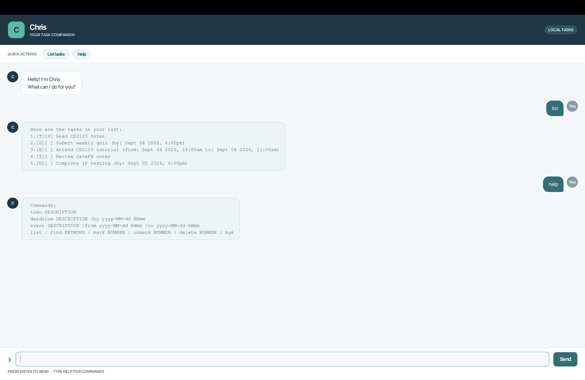

# Chris User Guide

Chris is a small desktop chatbot for tracking todos, deadlines, and events. It remembers your tasks between sessions. Type a command in the box at the bottom of the window and press **Enter** or click **Send**.



## Getting started

Install Java 25, download `chris.jar` from the [latest release](https://github.com/Krtin888/ip/releases), and place the JAR in an empty writable folder. Open a terminal in that folder and run:

```text
java -jar chris.jar
```

Chris writes `data/chris.txt` relative to the folder from which you start it. Reopen it from the same folder to see your saved tasks. If you start from another folder, Chris will use a different `data` folder.

Type `help` at any time for a compact command list. Command words are lowercase. Dates and times use `yyyy-MM-dd HHmm`, with a 24-hour time: `2026-12-02 1800` means 2 December 2026 at 6:00 pm. Impossible dates, such as 30 February, are rejected.

The **List tasks** and **Help** buttons provide quick access to those two commands. They do not erase a command you have started typing.

## Commands

| What you want to do | Command | Example |
| --- | --- | --- |
| Add a todo | `todo DESCRIPTION` | `todo read book` |
| Add a deadline | `deadline DESCRIPTION /by DATE TIME` | `deadline return book /by 2026-12-02 1800` |
| Add an event | `event DESCRIPTION /from DATE TIME /to DATE TIME` | `event project meeting /from 2026-12-03 1400 /to 2026-12-03 1600` |
| See every task | `list` | `list` |
| Find tasks by description | `find KEYWORD` | `find book` |
| Complete a task | `mark NUMBER` | `mark 2` |
| Make a task incomplete | `unmark NUMBER` | `unmark 2` |
| Remove a task | `delete NUMBER` | `delete 2` |
| See command syntax | `help` | `help` |
| Close Chris | `bye` | `bye` |

For an event, `/to` must be later than `/from`. Run `list` to find the current task numbers before marking, unmarking, or deleting; numbers change after deletion. `find` searches descriptions without regard to letter case, but its results are numbered from 1 independently of the full list. Use the number from `list` for subsequent actions.

A task appears as `[T][ ] read book`: `T` means todo, `D` deadline, and `E` event. `X` in the second pair of brackets means completed. For example:

```text
todo read book
Got it. I've added this task:
  [T][ ] read book

mark 1
Nice! I've marked this task as done:
  [T][X] read book
```

Tasks are saved automatically after each change. Deletion is immediate and has no undo. Descriptions cannot contain `|` or line breaks because the data file uses those characters to separate records.

## If something goes wrong

Invalid commands and dates produce an `OOPS!!!` reply highlighted in red; correct the command and try again. If Chris reports that a saved task is invalid, it switches to read-only mode so it cannot overwrite your original `data/chris.txt`. Back up the file, correct the reported line, then restart Chris. If a save fails (for example, the folder is not writable), Chris reports the problem; make the folder writable and retry.

`list`, `help`, and `bye` take no additional words; `list all` and `bye now` are rejected so typos are not mistaken for successful commands. Leading and trailing spaces around commands are harmless.

The desktop window can be resized. The conversation scrolls to the newest message as you add tasks, and the input remains focused so you can continue typing commands.
